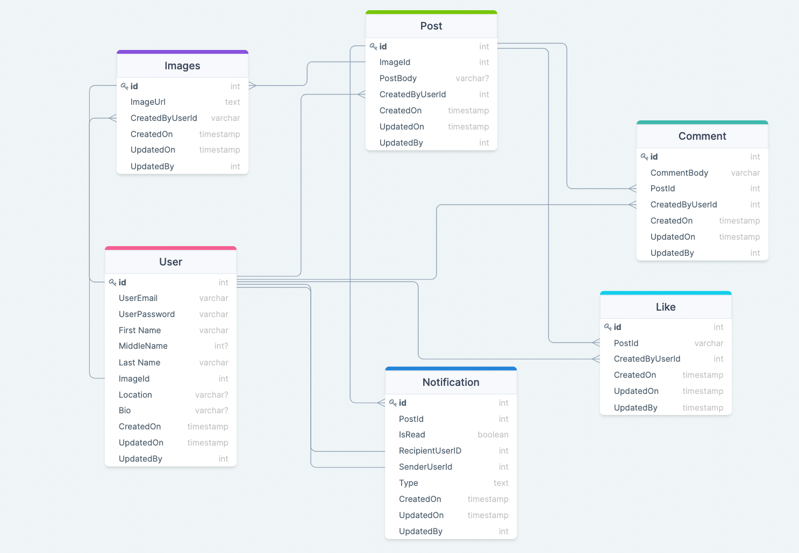

# Social Media Application
Social Media Application(SMA) with .NET 6 preview as back end and variety of front end consummators

Warning: The MVC project is not oriented towards the end user it was made to show the data in its row format. 
The end user clients is planned at a later stage

# Database schema

# Web Clients

### React
 
- Will be linked later
---

### Angular

- Will be linked later

---

### MVC

- MVC will be ONLY used to display the RAW data! This is not supposed to be used by the end clients 

---

# Mobile Clients

### React Native

- Will be linked later

---

### Flutter

- Will be linked later
