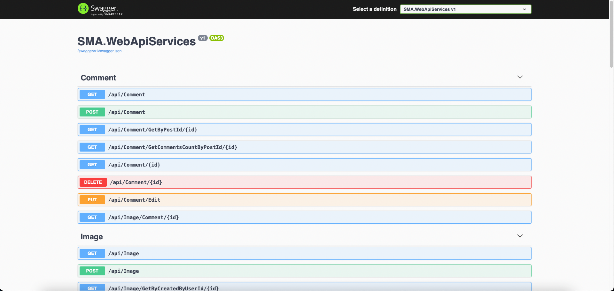
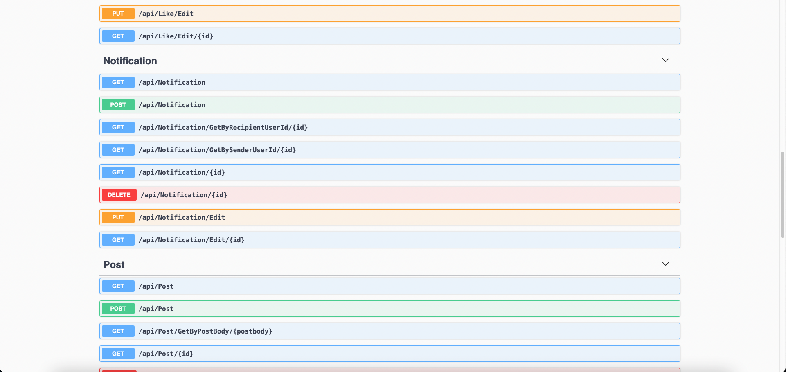
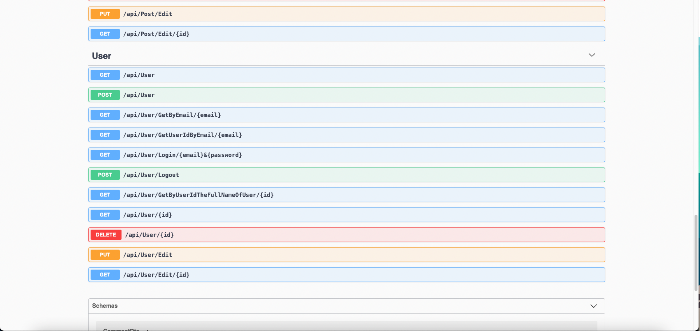

# Social Media Application
Social Media Application(SMA) with .NET 6 preview as back end and variety of front end consummators.
Uses JWT token for authentication. The project supports swagger and it shows the api endpoints.

If you want to run the project first you should change the connection string in Core/SMA.Data/Contexts/SmaDbContext.cs and then you can make/update migrations
using "dotnet ef" tool

The project uses Postgresql for data storing!

Warning: The MVC project is not oriented towards the end user it was made to show the data in its row format. 
The end user clients is planned at a later stage

# Database schema

# Web Clients

### React
 
- Working in progress. Will be linked the repositories later
---

### Angular

-  Working in progress. Will be linked the repositories later

---

### MVC

- MVC will be ONLY used to display the RAW data! This is not supposed to be used by the end clients 

---

# Mobile Clients

### React Native

-  Working in progress. Will be linked the repositories later

---

### Flutter

-  Working in progress. Will be linked the repositories later

# Swagger 

Api endpoints/documentation

